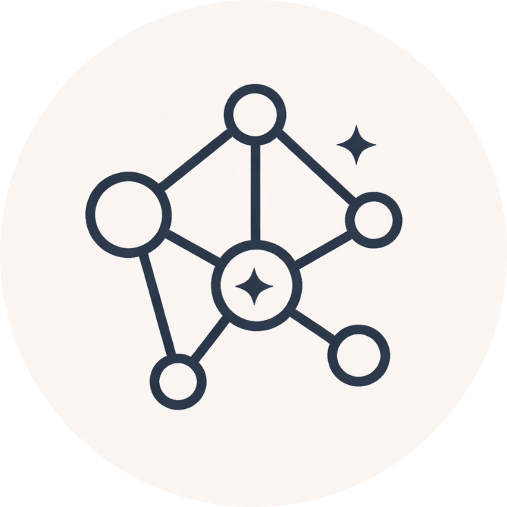
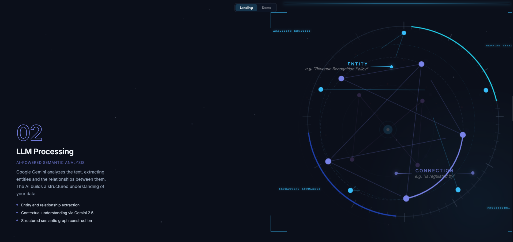
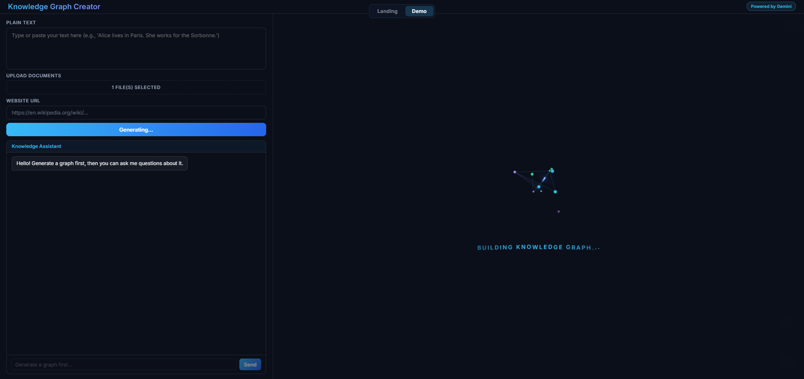
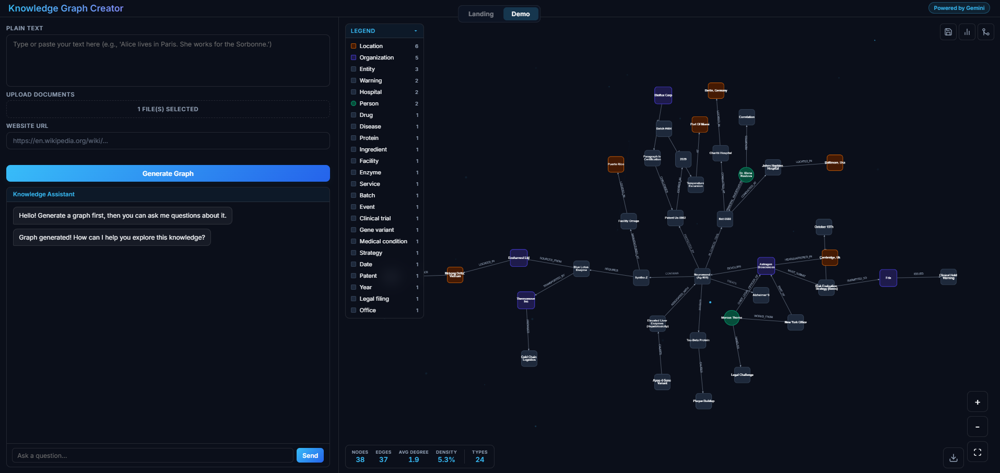
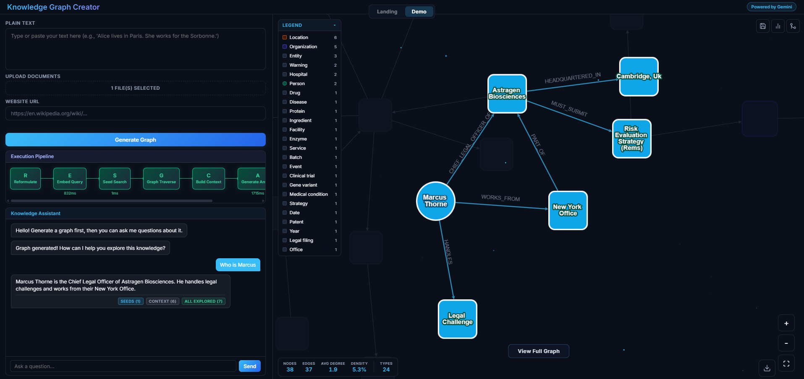
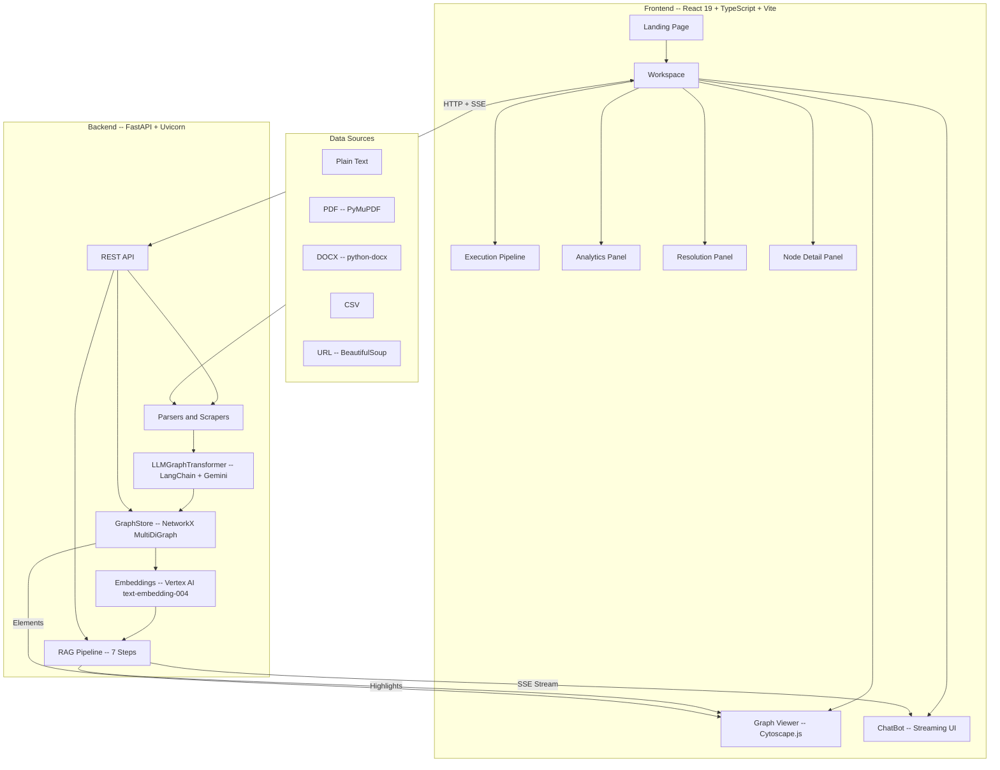
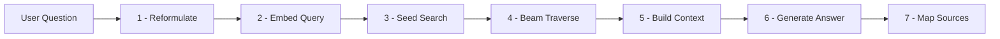

<div align="center">



# Knowledge Graph-Powered AI Agent

**Transform unstructured data into interactive knowledge graphs. Ask questions. Get answers grounded in your data.**

[](https://www.python.org/)
[](https://fastapi.tiangolo.com/)
[](https://react.dev/)
[](https://www.typescriptlang.org/)
[](https://vite.dev/)
[](https://cloud.google.com/vertex-ai)
[](https://networkx.org/)
[](https://www.langchain.com/)

</div>

---

## Screenshots

<div align="center">

| Landing Page (LLM Processing section) | Building the Knowledge Graph |
|:---:|:---:|
|  |  |

| Knowledge Graph Completed | AI Agent Inference |
|:---:|:---:|
|  |  |

</div>

---

## What It Does

Knowledge Graph-Powered AI Agent takes any unstructured content -- a PDF, a Word document, a webpage, or plain text -- and uses a large language model to automatically extract the entities and relationships hidden inside it, building a navigable knowledge graph in seconds. Once the graph is built, you can chat with it: ask natural-language questions and receive answers that are grounded in the graph's data through a custom Retrieval-Augmented Generation (RAG) pipeline that visually traces its reasoning path across the graph in real time.

---

## Key Features

### Core

- **Automatic Knowledge Graph Generation** -- Extracts entities and relationships from text, documents, and web pages using LangChain's LLMGraphTransformer powered by Gemini 2.5 Flash.
- **Multi-Format Ingestion** -- Supports plain text, PDF, DOCX, CSV file uploads, and URL scraping out of the box.
- **Interactive Graph Visualization** -- Explore the graph with a Cytoscape.js viewer using force-directed layouts, type-based node styling, hover focus, and animated edge rendering.

### Intelligence

- **RAG-Powered Conversational Q&A** -- A 7-step retrieval pipeline (reformulation, embedding, seed search, beam-search traversal, context assembly, generation, source mapping) answers questions grounded in the graph.
- **Live Streaming Pipeline** -- Every step streams to the UI via Server-Sent Events: traversal hops animate across the graph, tokens appear in real time, and referenced nodes light up.
- **Conversation Memory** -- Multi-turn chat with pronoun resolution and context-aware query reformulation, so follow-up questions work naturally.
- **Entity Resolution** -- Detects duplicate entities using embedding cosine similarity and lets you merge them with one click.

### Tools

- **Graph Editing** -- Add, update, and delete nodes and edges directly from the UI.
- **Graph Analytics** -- Degree, betweenness, PageRank centrality; Louvain community detection; clustering coefficients; connected components.
- **Session Management** -- Save, load, and delete named graph sessions persisted as JSON.
- **Export** -- Download your graph as JSON (Cytoscape-compatible), GEXF (Gephi-compatible), or CSV.

---

## Architecture



---

## Tech Stack

<table>
<tr>
<td><b>Frontend</b></td>
<td>


</td>
</tr>
<tr>
<td><b>Backend</b></td>
<td>


</td>
</tr>
<tr>
<td><b>AI / ML</b></td>
<td>


</td>
</tr>
<tr>
<td><b>Parsing</b></td>
<td>


</td>
</tr>
</table>

---

## RAG Chat Pipeline

When a user asks a question, the system executes a 7-step retrieval-augmented generation pipeline -- all streamed to the UI in real time:



| Step | What happens |
| --- | --- |
| **1. Reformulate** | Gemini rewrites the message as a standalone question, resolving pronouns from conversation history (e.g. *"Where does he work?"* becomes *"Where does Marcus Thorne work?"*). |
| **2. Embed** | The reformulated query is embedded using Vertex AI `text-embedding-004`. |
| **3. Seed Search** | Cosine similarity against all node embeddings finds the most relevant starting points (threshold ~0.35-0.40). |
| **4. Beam Traverse** | A beam-search expands outward from seed nodes (2-3 hops), scoring neighbors by relevance, including bridge nodes that connect clusters. |
| **5. Build Context** | The selected subgraph is serialized into a structured text context for the LLM. |
| **6. Generate** | Gemini produces an answer grounded in the graph context, streamed token-by-token. |
| **7. Map Sources** | Referenced nodes are identified and highlighted in the graph with 3-tier coloring: seeds, traversed, and context nodes. |

---

## Getting Started

### Prerequisites

- **Python** >= 3.14
- **Node.js** >= 18 (with npm)
- **uv** -- Fast Python package manager ([install guide](https://docs.astral.sh/uv/getting-started/installation/))
- **Google Cloud Service Account** -- JSON key with Vertex AI API access (Gemini + text-embedding-004)

### Backend

```bash
git clone <repository-url>
cd KnowledgeGraphsAIAgents/backend
```

Configure your credentials (set the env var or update the path in `backend/main.py`):

```bash
export GOOGLE_APPLICATION_CREDENTIALS="/path/to/service_account.json"
```

Install and run:

```bash
uv sync
uv run python main.py          # starts at http://localhost:8000
```

<details>
<summary>Alternative: pip</summary>

```bash
pip install -r requirements.txt
python main.py
```

</details>

### Frontend

```bash
cd ../frontend
npm install
npm run dev                     # starts at http://localhost:5173
```

The Vite dev server proxies all API requests to the backend automatically.

---

## Supported Input Formats

| Format | Extension | Parser | Notes |
| --- | --- | --- | --- |
| Text | `.txt` | Built-in | Plain UTF-8 |
| PDF | `.pdf` | PyMuPDF | Multi-page extraction |
| Word | `.docx` | python-docx | Paragraph-level extraction |
| CSV | `.csv` | Python stdlib | Row-by-row key-value representation |
| URL | -- | BeautifulSoup | Strips navigation and ads |

---

## Export Formats

| Format | Compatible With |
| --- | --- |
| **JSON** | Cytoscape.js, custom tooling |
| **GEXF** | Gephi, NetworkX |
| **CSV** | Excel, Pandas, any spreadsheet tool |

---

<details>
<summary><h2>API Reference</h2></summary>

### Graph Generation

| Method | Endpoint | Description |
| --- | --- | --- |
| POST | `/generate-graph` | Create a knowledge graph from text, files, or a URL |

**Parameters** (multipart form data):
- `text` (string, optional) -- Raw text input
- `files` (file[], optional) -- Upload TXT, PDF, DOCX, or CSV files
- `url` (string, optional) -- URL to scrape
- `mode` (`replace` | `merge`) -- Replace existing graph or merge into it

### Chat

| Method | Endpoint | Description |
| --- | --- | --- |
| POST | `/chat` | Non-streaming chat response |
| POST | `/chat-stream` | Streaming SSE response with pipeline steps |

**Request body:** `{ "message": "your question" }`

**SSE event types** (`/chat-stream`):
- `step` -- Pipeline step status update
- `token` -- Individual token from the LLM response
- `traversal_seeds` -- Initial seed nodes found via embedding similarity
- `traversal_hop` -- Frontier nodes discovered at each hop
- `result` -- Final complete answer with highlighted nodes
- `error` -- Error message

### Entity Resolution

| Method | Endpoint | Description |
| --- | --- | --- |
| GET | `/resolve-entities` | Find duplicate entity candidates (similarity >= threshold) |
| POST | `/merge-entities` | Merge specified entity pairs |

### Graph Editing

| Method | Endpoint | Description |
| --- | --- | --- |
| POST | `/nodes` | Add a new node |
| PATCH | `/nodes/{node_id}` | Update a node |
| DELETE | `/nodes/{node_id}` | Delete a node |
| POST | `/edges` | Add a new edge |
| DELETE | `/edges` | Delete an edge |

### Sessions

| Method | Endpoint | Description |
| --- | --- | --- |
| GET | `/sessions` | List all saved sessions |
| POST | `/sessions` | Save current graph as a session |
| GET | `/sessions/{name}` | Load a saved session |
| DELETE | `/sessions/{name}` | Delete a saved session |

### Analytics & Export

| Method | Endpoint | Description |
| --- | --- | --- |
| GET | `/analytics` | Graph metrics (degree, betweenness, PageRank, communities, clustering) |
| GET | `/export` | Export graph (`json`, `gexf`, or `csv`) |

</details>

---

<details>
<summary><h2>Project Structure</h2></summary>

```
KnowledgeGraphsAIAgents/
├── README.md
├── .gitignore
│
├── backend/
│   ├── main.py                  # FastAPI application
│   ├── graph_creator.py         # LLM -> NetworkX graph conversion
│   ├── parsers.py               # Document parsers (PDF, DOCX, CSV, TXT)
│   ├── scrapers.py              # URL scraping with BeautifulSoup
│   ├── requirements.txt
│   ├── pyproject.toml
│   └── sessions/                # Saved graph sessions (JSON)
│
├── frontend/
│   ├── package.json
│   ├── vite.config.ts           # Vite config with API proxy
│   ├── index.html
│   ├── public/                  # Static assets & logos
│   └── src/
│       ├── main.tsx             # React entry point
│       ├── App.tsx              # Root component (Landing -> Workspace)
│       ├── api/
│       │   └── graphApi.ts      # API client & TypeScript interfaces
│       ├── components/
│       │   ├── LandingPage.tsx
│       │   ├── Workspace.tsx
│       │   ├── GraphViewer.tsx  # Cytoscape graph renderer
│       │   ├── ChatBot.tsx      # Streaming chat interface
│       │   ├── ExecutionPipeline.tsx
│       │   ├── AnalyticsPanel.tsx
│       │   ├── ResolutionPanel.tsx
│       │   ├── NodeDetailPanel.tsx
│       │   ├── SessionPanel.tsx
│       │   ├── ExportMenu.tsx
│       │   └── ...
│       ├── hooks/
│       │   └── useAnime.ts
│       └── styles/
│           └── global.css
│
├── main.py                      # Lightweight backend (sentence-transformers)
└── index.html                   # Standalone HTML frontend (legacy)
```

</details>

---

## License

This project is proprietary. All rights reserved.

---

<div align="center">

**Built by Bruno** -- [LinkedIn](https://www.linkedin.com/in/YOUR-LINKEDIN-HANDLE/)

</div>
